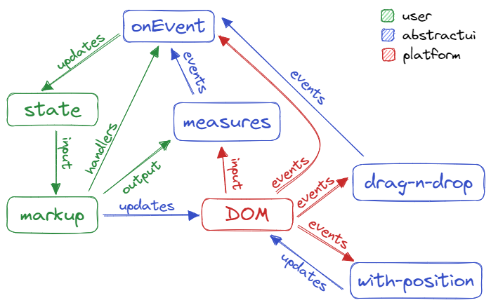

> ### abstract
>
> _adjective_ \
> existing in thought or as an idea but not having a physical or concrete existence.
>
> _verb_ \
> extract or remove (something).
>
> _origin_ \
> abstractus: drawn away

# abstractui

